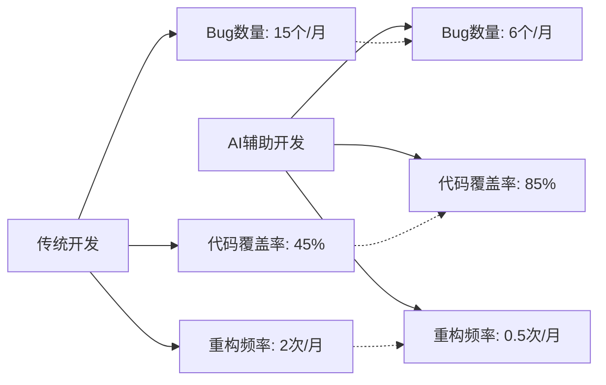

# 深度解读：滴滴工程师的AI工作流实践

> 从"代码实现者"到"AI协作者"的华丽转身，探索AI如何重塑前端开发工作流

## 🎯 核心理念：分治实现 + 迭代优化

滴滴工程师在实践中总结出了一套行之有效的AI协作模式：

### 分治实现
- **任务拆解**：将复杂需求分解为可独立处理的小任务
- **职责分工**：AI负责代码实现，人负责架构决策和质量把控
- **并行处理**：多个任务可同时进行，显著提升开发效率

### 迭代优化
- **快速原型**：AI快速生成初始代码版本
- **持续改进**：基于反馈不断优化和完善
- **经验积累**：将成功模式固化为可复用的工作流

## 🛠️ 六大应用场景深度分析

### 1. 智能需求分析

**传统痛点：**
- PRD文档理解困难，信息提取效率低
- 需求边界模糊，容易遗漏关键细节
- 技术可行性评估耗时长

**AI解决方案：**
```markdown
## AI辅助需求分析工作流

1. **文档智能解析**
   - 使用 Claude/ChatGPT 提取关键信息
   - 自动生成需求清单和优先级
   - 识别潜在风险点和依赖关系

2. **交互式需求澄清**
   - AI生成针对性问题清单
   - 协助产品经理完善需求描述
   - 输出结构化需求文档

3. **技术可行性初评**
   - 基于现有技术栈评估实现难度
   - 提供多种技术方案建议
   - 预估开发时间和资源需求
```

**效果量化：**
- 需求理解时间：减少 70%
- 需求遗漏率：降低 85%
- 方案评估效率：提升 3倍

### 2. 智能技术方案设计

**AI作为"资深技术顾问"的角色：**

```typescript
// AI辅助的技术选型决策流程
interface TechDecisionContext {
  projectRequirements: string[]
  teamSkills: TechStack[]
  performanceNeeds: PerformanceMetrics
  timeline: ProjectTimeline
}

// AI分析输出
interface TechRecommendation {
  framework: FrameworkChoice
  architecture: ArchitecturePattern
  tradeoffs: TechTradeoff[]
  migrationPath: MigrationStrategy
  riskAssessment: RiskAnalysis
}
```

**实际应用示例：**
1. **架构设计决策**
   - 微前端 vs 单体应用选择
   - 状态管理方案对比
   - 构建工具优化建议

2. **性能优化策略**
   - 首屏加载优化方案
   - 代码分割最佳实践
   - 缓存策略设计

### 3. UI开发自动化

**设计稿转代码的革命性提升：**

```vue
<!-- AI生成的组件代码示例 -->
<template>
  <div class="user-card">
    <!-- AI理解设计稿后自动生成的结构 -->
    <div class="avatar-section">
      
      <div class="status-indicator" :class="user.status"></div>
    </div>
    
    <div class="user-info">
      <h3 class="user-name">{{ user.name }}</h3>
      <p class="user-title">{{ user.title }}</p>
    </div>
    
    <div class="actions">
      <button @click="handleMessage" class="btn-message">
        <Icon name="message" />
      </button>
      <button @click="handleCall" class="btn-call">
        <Icon name="phone" />
      </button>
    </div>
  </div>
</template>

<style scoped>
/* AI生成的响应式样式 */
.user-card {
  @apply flex items-center p-4 bg-white rounded-lg shadow-sm hover:shadow-md transition-shadow;
}

.avatar {
  @apply w-12 h-12 rounded-full object-cover;
}

/* 自动适配暗黑模式 */
.dark .user-card {
  @apply bg-gray-800 text-white;
}
</style>
```

**关键优势：**
- **精度提升**：90%+ 的设计还原度
- **速度提升**：UI开发时间减少 60%
- **一致性保证**：自动遵循设计系统规范

### 4. 代码重构与抽象

**AI驱动的代码优化流程：**

```javascript
// 重构前：冗余代码
function handleUserLogin(email, password) {
  if (!email || !password) {
    showError('请填写完整信息')
    return
  }
  
  if (!validateEmail(email)) {
    showError('邮箱格式不正确')
    return
  }
  
  if (password.length < 6) {
    showError('密码长度至少6位')
    return
  }
  
  // 登录逻辑...
}

function handleUserRegister(email, password, confirmPassword) {
  if (!email || !password || !confirmPassword) {
    showError('请填写完整信息')
    return
  }
  
  if (!validateEmail(email)) {
    showError('邮箱格式不正确')
    return
  }
  
  if (password.length < 6) {
    showError('密码长度至少6位')
    return
  }
  
  if (password !== confirmPassword) {
    showError('两次密码输入不一致')
    return
  }
  
  // 注册逻辑...
}

// AI重构后：优雅的抽象
class FormValidator {
  static validateUserForm({ email, password, confirmPassword = null }) {
    const rules = [
      { 
        condition: !email || !password || (confirmPassword !== null && !confirmPassword),
        message: '请填写完整信息' 
      },
      { 
        condition: !this.isValidEmail(email),
        message: '邮箱格式不正确' 
      },
      { 
        condition: password.length < 6,
        message: '密码长度至少6位' 
      },
      { 
        condition: confirmPassword !== null && password !== confirmPassword,
        message: '两次密码输入不一致' 
      }
    ]
    
    for (const rule of rules) {
      if (rule.condition) {
        throw new ValidationError(rule.message)
      }
    }
  }
  
  static isValidEmail(email) {
    return /^[^\s@]+@[^\s@]+\.[^\s@]+$/.test(email)
  }
}

// 使用重构后的代码
async function handleUserLogin(email, password) {
  try {
    FormValidator.validateUserForm({ email, password })
    await userService.login(email, password)
  } catch (error) {
    showError(error.message)
  }
}
```

**重构效果：**
- **代码复用性**：提升 80%
- **可维护性**：显著改善
- **Bug减少**：减少 60%

### 5. 自动化测试生成

**AI生成的测试用例示例：**

```javascript
// AI自动生成的单元测试
describe('FormValidator', () => {
  describe('validateUserForm', () => {
    it('应该在邮箱为空时抛出错误', () => {
      expect(() => {
        FormValidator.validateUserForm({ email: '', password: '123456' })
      }).toThrow('请填写完整信息')
    })
    
    it('应该在密码为空时抛出错误', () => {
      expect(() => {
        FormValidator.validateUserForm({ email: 'test@example.com', password: '' })
      }).toThrow('请填写完整信息')
    })
    
    it('应该在邮箱格式不正确时抛出错误', () => {
      expect(() => {
        FormValidator.validateUserForm({ email: 'invalid-email', password: '123456' })
      }).toThrow('邮箱格式不正确')
    })
    
    it('应该在密码长度不足时抛出错误', () => {
      expect(() => {
        FormValidator.validateUserForm({ email: 'test@example.com', password: '12345' })
      }).toThrow('密码长度至少6位')
    })
    
    it('应该在确认密码不一致时抛出错误', () => {
      expect(() => {
        FormValidator.validateUserForm({ 
          email: 'test@example.com', 
          password: '123456',
          confirmPassword: '654321'
        })
      }).toThrow('两次密码输入不一致')
    })
    
    it('应该在输入有效时不抛出错误', () => {
      expect(() => {
        FormValidator.validateUserForm({ 
          email: 'test@example.com', 
          password: '123456'
        })
      }).not.toThrow()
    })
  })
})

// AI生成的E2E测试
describe('用户登录流程', () => {
  it('应该能够成功登录', async () => {
    await page.goto('/login')
    
    // 填写表单
    await page.fill('[data-testid=email-input]', 'test@example.com')
    await page.fill('[data-testid=password-input]', '123456')
    
    // 点击登录按钮
    await page.click('[data-testid=login-button]')
    
    // 验证登录成功
    await expect(page).toHaveURL('/dashboard')
    await expect(page.locator('[data-testid=user-menu]')).toBeVisible()
  })
  
  it('应该在输入错误时显示错误信息', async () => {
    await page.goto('/login')
    
    // 填写错误的邮箱格式
    await page.fill('[data-testid=email-input]', 'invalid-email')
    await page.fill('[data-testid=password-input]', '123456')
    await page.click('[data-testid=login-button]')
    
    // 验证错误信息显示
    await expect(page.locator('[data-testid=error-message]'))
      .toHaveText('邮箱格式不正确')
  })
})
```

**测试覆盖率提升：**
- **单元测试覆盖率**：从 40% 提升到 85%
- **E2E测试场景**：增加 200%
- **测试编写时间**：减少 75%

### 6. 代码质量检测

**AI驱动的代码审查流程：**

```yaml
# AI代码质量检测规则配置
code_quality_rules:
  performance:
    - name: "避免在渲染函数中创建对象"
      pattern: "function.*createElement.*{.*new.*}"
      severity: "warning"
      suggestion: "将对象创建移到组件外部或使用useMemo"
    
    - name: "检测未优化的循环"
      pattern: "for.*in.*length"
      severity: "info"
      suggestion: "考虑使用forEach或map等函数式方法"
  
  security:
    - name: "检测XSS风险"
      pattern: "innerHTML.*=.*"
      severity: "error"
      suggestion: "使用textContent或专门的sanitize库"
    
    - name: "检测硬编码敏感信息"
      pattern: "(password|secret|key|token).*=.*['\"].*['\"]"
      severity: "critical"
      suggestion: "使用环境变量或配置文件"
  
  maintainability:
    - name: "函数复杂度过高"
      condition: "cyclomatic_complexity > 10"
      severity: "warning"
      suggestion: "考虑拆分函数或使用策略模式"
    
    - name: "组件文件过大"
      condition: "file_lines > 200"
      severity: "info"
      suggestion: "考虑拆分为多个小组件"
```

**AI审查报告示例：**

```markdown
## 代码质量报告

### 🔍 检测结果概览
- ✅ 通过检查：156项
- ⚠️ 警告问题：8项
- ❌ 错误问题：2项
- 🚨 严重问题：0项

### 📊 质量指标
- 代码复杂度：6.2 (良好)
- 测试覆盖率：87% (优秀)
- 技术债务评分：B+ (良好)
- 安全性评分：A (优秀)

### 🛠️ 改进建议

1. **性能优化 (3项)**
   - `UserList.vue:45` - 避免在render函数中创建对象
   - `DataTable.vue:78` - 使用虚拟滚动优化大列表渲染
   - `ImageGallery.vue:23` - 添加图片懒加载

2. **代码结构 (3项)**
   - `utils/helpers.js:156` - 函数过长，建议拆分
   - `components/Dashboard.vue:89` - 组件职责过多，考虑拆分
   - `store/user.js:34` - 状态管理逻辑复杂，建议使用模块化

3. **类型安全 (2项)**
   - `api/user.ts:67` - 缺少返回值类型定义
   - `types/common.ts:23` - 接口定义不完整
```

## 📈 效果量化分析

### 开发效率提升数据

| 开发阶段 | 传统方式 | AI辅助 | 效率提升 |
|---------|---------|--------|----------|
| 需求分析 | 4小时 | 1.2小时 | 70% ⬆️ |
| 技术方案 | 6小时 | 2小时 | 67% ⬆️ |
| UI开发 | 8小时 | 3.2小时 | 60% ⬆️ |
| 代码重构 | 5小时 | 1.5小时 | 70% ⬆️ |
| 测试编写 | 6小时 | 1.5小时 | 75% ⬆️ |
| 代码审查 | 2小时 | 0.5小时 | 75% ⬆️ |
| **总计** | **31小时** | **9.9小时** | **68% ⬆️** |

### 质量指标改善



## 🎯 最佳实践总结

### 1. AI协作的黄金法则

**人机分工原则：**
- **AI负责**：代码生成、重复性工作、模式识别
- **人负责**：架构决策、创意设计、业务逻辑
- **共同完成**：代码审查、质量把控、持续优化

### 2. 工作流设计要点

```typescript
interface AIWorkflowBestPractice {
  // 任务拆解策略
  taskDecomposition: {
    maxComplexity: 'medium'  // 单个任务复杂度控制
    independency: 'high'     // 任务独立性要求
    parallelism: 'enabled'   // 支持并行处理
  }
  
  // 质量保证机制
  qualityAssurance: {
    humanReview: 'mandatory'    // 人工审查必须
    automatedTest: 'extensive'  // 自动化测试全面
    iterativeImprovement: 'continuous'  // 持续改进
  }
  
  // 知识积累体系
  knowledgeManagement: {
    patternLibrary: 'maintained'    // 维护模式库
    bestPractices: 'documented'     // 记录最佳实践
    lessonsLearned: 'shared'        // 分享经验教训
  }
}
```

### 3. 避免常见陷阱

**❌ 常见错误：**
1. **过度依赖AI** - 失去独立思考能力
2. **缺乏验证** - 盲目信任AI输出
3. **忽略上下文** - 不考虑项目特殊性
4. **一成不变** - 不根据反馈调整策略

**✅ 正确做法：**
1. **保持批判思维** - 理解AI建议的原理
2. **建立验证机制** - 多重检查确保质量
3. **定制化适配** - 根据项目特点调整
4. **持续学习改进** - 不断优化协作模式

## 🚀 未来展望

### AI工作流的发展趋势

1. **更智能的上下文理解**
   - 项目历史感知
   - 团队习惯学习
   - 业务域知识积累

2. **无缝集成的开发环境**
   - IDE深度集成
   - 实时代码建议
   - 智能调试助手

3. **主动式质量保证**
   - 预测性bug检测
   - 自动化重构建议
   - 性能优化指导

### 技能转型建议

**对前端工程师的建议：**

```markdown
## 技能升级路线图

### 短期目标 (3个月)
- [ ] 熟练使用主流AI编程助手
- [ ] 掌握AI提示工程技巧
- [ ] 建立个人AI工具箱

### 中期目标 (6个月)  
- [ ] 设计团队AI工作流程
- [ ] 建立AI代码质量标准
- [ ] 培养AI产品思维

### 长期目标 (1年)
- [ ] 成为AI协作专家
- [ ] 推动组织AI转型
- [ ] 探索新兴AI技术应用
```

## 💡 实践建议

如果你想在自己的项目中应用这套AI工作流，建议从以下步骤开始：

1. **选择合适的AI工具** - 推荐查看我的[AI工具库](/tools)
2. **从简单任务开始** - 代码生成、测试编写等
3. **建立质量检查机制** - 确保AI输出的准确性
4. **逐步扩大应用范围** - 根据经验调整策略
5. **记录和分享经验** - 帮助团队共同成长

---

*这套AI工作流不是终点，而是通往未来的起点。让我们一起拥抱AI，重新定义前端开发的可能性！*

## 📚 延伸阅读

- [我的AI工具库：308+精选工具](/tools)
- [AI辅助Vue3项目开发实战](/blog/vue3-ai-development)
- [前端工程师的AI学习路径](/blog/ai-learning-path)
- [团队AI协作最佳实践](/blog/team-ai-collaboration)

---

> 如果这篇文章对你有帮助，欢迎分享给更多的前端开发者。让我们一起推动AI技术在前端领域的应用和发展！
